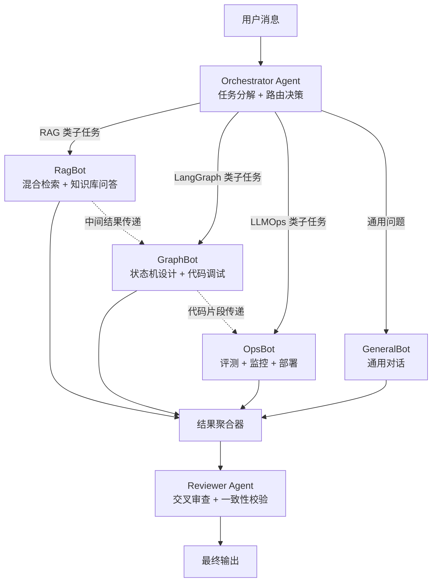
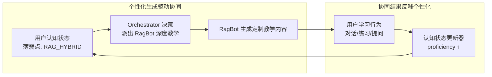

# 知链（CogniLink）二期架构设计 — 领域知识个性化生成与多智能体协同决策

> 本文档基于一期功能完善度评估，针对项目核心愿景中尚未落地的两大能力维度进行深化设计，作为下一开发阶段的指导方案。

---

## 一、当前差距诊断（代码实证）

### 1.1 多智能体协同 — "单路由"而非"协同"

| 维度 | 项目定位（愿景） | 当前实现（代码实态） | 差距 |
|------|------------------|----------------------|------|
| Agent 参与模式 | 多智能体协同培养 | `agent_service.route_agent()` 返回**单个** Agent 的 system_prompt | 1对1 路由选择，非多 Agent 协同 |
| LangGraph 状态机 | 核心愿景提及 LangGraph | 全后端 grep：**零** `from langgraph import` 语句 | 状态机编排引擎完全未落地 |
| 工具调用循环 | `use_tools=True` 支持 | `llm_service.py:115-129` 传入 `tools` + `tool_choice="auto"`，但流式循环只提取 `delta.content`，**未处理 `tool_calls`** | Tool calling 循环断裂 |
| 中间结果传递 | Agent 间协作 | 无 | Agent B 无法读取 Agent A 的输出 |
| 质量保障 | — | 无 Reviewer 审查机制 | 无交叉校验 |

### 1.2 领域知识个性化 — "被动检索"而非"主动生成"

| 维度 | 当前实现 | 差距 |
|------|----------|------|
| 知识图谱 | `toggle_node_light` 手动开关 + `proficiency` 粗粒度浮点 | 无行为驱动的自动认知状态更新 |
| PageRank 拟合 | `knowledge_service.compute_pagerank` = `weight × (1 + in_degree × 0.1)` | 伪实现，非迭代 PageRank 算法 |
| Agent prompt | 从数据库静态读取 system_prompt | 未注入用户认知状态，Agent 不"认识"用户 |
| 练习内容 | 管理员预定义 Lab 题库 | 未基于薄弱点 LLM 动态出题 |
| 学习路径 | 无 | 未基于图拓扑推荐下一学习目标 |

**一句话总结**：项目当前是 **"静态知识 + 单 Agent 路由 + 被动检索"**，目标是 **"动态生成 + 多 Agent 协同 + 主动适配"**。

---

## 二、领域知识个性化生成

### 2.1 用户认知建模 — 从"点亮开关"到"认知向量"

```
用户行为流 → 认知状态更新器 → UserKnowledgeState → 认知向量 → 个性化引擎
(对话/练习/阅读)                    (proficiency/mastery)    (方向维度)       (策略生成)
```

**关键改造点**：

- `toggle_node_light` 从手动开关改为**行为驱动自动更新**：
  - 对话中涉及某知识节点 → 自动提升 proficiency
  - 练习通过 → 大幅提升
  - 练习失败 → 标记为"薄弱点"
- 基于知识图谱拓扑，用**迭代 PageRank** 计算每个节点对当前用户的"重要度分数"
- 未掌握的高权重节点 + 其前置依赖未满足 = 最该学的目标

### 2.2 真正的 PageRank — 拟合学习曲线

替换当前 `knowledge_service.py:184-209` 的伪实现为迭代算法：

```python
# 迭代 PageRank
# PR(node) = (1-d) + d × Σ [PR(前置节点) / 出度]
# d = 0.85 (阻尼系数)
# 迭代至收敛 (Δ < 0.001)

# 学习曲线拟合逻辑：
# - 用户已掌握的节点 PR 值置 0（不再传播）
# - 未掌握节点的 PR 值 = 其在"剩余知识图"中的拓扑重要度
# - PR 值最高的未掌握节点 = 系统推荐的下一个学习目标
# - 这就是"基于图拓扑拟合学习曲线"的真正含义
```

### 2.3 动态 system_prompt 生成 — 让 Agent "认识"用户

当前 Agent 的 system_prompt 是静态文本。深化方案：

```python
def build_personalized_prompt(agent, user_state, graph_data):
    base_prompt = agent.system_prompt  # 静态基础人设

    cognitive_profile = f"""
    ## 当前学员认知状态
    - RAG 方向掌握度: {user_state.rag_proficiency} (薄弱点: {user_state.rag_weak_nodes})
    - LangGraph 方向掌握度: {user_state.langgraph_proficiency}
    - 推荐学习路径: {graph_data.recommended_path}
    - 最近薄弱知识点: {user_state.recent_failures}

    ## 教学策略
    - 对薄弱点采用"苏格拉底式引导"而非直接给答案
    - 在用户已掌握的概念上加速，在薄弱处放慢
    """

    return base_prompt + cognitive_profile
```

### 2.4 自适应练习生成 — LLM 动态出题

当前 Lab 是管理员预定义的。深化方案：基于用户薄弱知识节点，LLM 动态生成针对性练习：

```
输入：薄弱节点 "RAG_HYBRID" + 用户历史错误模式
    ↓ LLM 生成
输出：定制代码题（针对该用户在混合检索中常犯的错误设计）
```

---

## 三、多智能体协同决策

### 3.1 架构总览



### 3.2 LangGraph 状态机落地

项目定位明确提到 LangGraph，但代码中零使用。需新建 `services/graph_service.py`：

```python
from langgraph.graph import StateGraph, END
from typing import TypedDict

class AgentState(TypedDict):
    messages: list           # 对话历史
    user_cognitive_state: dict  # 用户认知画像
    sub_tasks: list          # Orchestrator 分解的子任务
    agent_results: dict      # 各 Agent 的中间结果
    final_answer: str        # 最终聚合结果
    needs_review: bool       # 是否需要交叉审查

def orchestrator_node(state):
    """任务分解：分析用户意图，决定哪些 Agent 需要参与"""
    # 不是"择一"，而是"可能多选"
    # 例如 "如何用 RAG 提升 LangGraph 多智能体的知识检索质量？"
    # → 同时需要 RagBot + GraphBot
    return {"sub_tasks": [...]}

def rag_bot_node(state):
    """RAG 导师：执行混合检索，返回知识库上下文"""
    return {"agent_results": {"rag": context}}

def graph_bot_node(state):
    """LangGraph 导师：基于 RAG 上下文设计状态机方案"""
    # 可以读取 rag_bot 的中间结果
    return {"agent_results": {"langgraph": design}}

def reviewer_node(state):
    """审查者：检查各 Agent 结果的一致性、准确性"""
    return {"final_answer": polished, "needs_review": False}

# 构建图
workflow = StateGraph(AgentState)
workflow.add_node("orchestrator", orchestrator_node)
workflow.add_node("rag_bot", rag_bot_node)
workflow.add_node("graph_bot", graph_bot_node)
workflow.add_node("reviewer", reviewer_node)

# 条件路由：Orchestrator 决定哪些 Agent 参与
workflow.add_conditional_edges(
    "orchestrator",
    route_to_agents,  # 返回需要执行的 Agent 列表
    {"rag": "rag_bot", "langgraph": "graph_bot", "end": "reviewer"}
)
workflow.add_edge("rag_bot", "graph_bot")  # RAG 结果传给 GraphBot
workflow.add_edge("graph_bot", "reviewer")
workflow.add_edge("reviewer", END)

app = workflow.compile()
```

### 3.3 关键差异：协同 vs 路由

| 维度 | 当前（单路由） | 深化后（多协同） |
|------|---------------|-----------------|
| Agent 参与数 | 1 个 | 1~N 个（Orchestrator 决定） |
| 中间结果传递 | 无 | Agent B 可读取 Agent A 的输出 |
| 质量保障 | 无 | Reviewer Agent 交叉审查 |
| 状态持久化 | 无 | LangGraph checkpoint 持久化工作流状态 |
| 失败恢复 | 无 | 可从检查点重试单个 Agent |

### 3.4 修复断裂的 Tool Calling 循环

当前 `llm_service.py:122-129` 的流式循环只提取 `delta.content`，丢弃了 `delta.tool_calls`。完整循环应该是：

```
LLM 返回 tool_call → 执行工具 → 将结果作为 tool message 回传 → LLM 继续生成
```

这是多智能体协同的基础设施——没有工具调用循环，Agent 就无法"行动"（搜索、检索、计算），只能"说话"。

---

## 四、两者融合的闭环

个性化生成与多智能体协同不是两个独立功能，而是**相互驱动**的闭环：



**具体场景示例**：

> 用户问："我的混合检索效果不好，怎么办？"
>
> 1. **Orchestrator** 分析：这是 RAG 领域问题 + 用户 `RAG_HYBRID` 节点 proficiency=0.2（薄弱）
> 2. 派出 **RagBot**：注入用户认知状态 → 采用"苏格拉底式引导" → 检索知识库中混合检索最佳实践
> 3. RagBot 中间结果传递给 **OpsBot**：生成一个 RAG 评测实验，让用户实操验证
> 4. **Reviewer** 审查：教学建议 + 评测实验的一致性
> 5. 输出给用户
> 6. 用户完成评测实验 → 认知状态更新器提升 `RAG_HYBRID` proficiency → 下次对话自动调整教学策略

---

## 五、落地优先级与任务分解

| 优先级 | 任务 | 涉及文件 | 依据 |
|--------|------|----------|------|
| **P0** | 修复 Tool Calling 循环 | `services/llm_service.py` | 多智能体协同的基础设施，当前断裂 |
| **P0** | 落地 LangGraph StateGraph | 新建 `services/graph_service.py` | 项目核心愿景，当前零代码 |
| **P1** | 实现迭代 PageRank + 学习路径推荐 | `services/knowledge_service.py` | "拟合学习曲线"的真正含义 |
| **P1** | 动态 system_prompt 注入用户认知状态 | `services/agent_service.py`、`api/chat.py` | 个性化的最小可行实现 |
| **P2** | Orchestrator + Reviewer 多 Agent 协同 | `services/graph_service.py`、`services/agent_service.py` | 从单路由升级为协同工作流 |
| **P2** | 行为驱动认知状态自动更新 | `services/knowledge_service.py`、`services/conversation_service.py` | 替代手动点亮 |
| **P3** | LLM 动态生成针对性练习 | `services/evaluation_service.py`、`api/labs.py` | 自适应出题 |

### 任务依赖关系

```
P0: Tool Calling 修复 ──┐
                        ├──→ P2: 多 Agent 协同 ──→ 闭环验证
P0: LangGraph 落地 ─────┘                                    ↑
                                                             │
P1: 迭代 PageRank ──────┐                                    │
P1: 动态 prompt 注入 ───┼──→ P2: 认知状态自动更新 ────────────┘
                         │
                         └──→ P3: 自适应练习生成
```

---

## 六、一期地基评估

项目当前的地基是扎实的：

| 模块 | 完善度 | 说明 |
|------|--------|------|
| 数据库建模 | 90% | 13 张表完整，`UserKnowledgeState` 已预留 `proficiency`/`pagerank_score` 字段 |
| RAG 混合检索 | 85% | BM25 + 向量 + RRF 融合，来源标注，私有/共享可见性 |
| Agent 路由框架 | 75% | 意图分类 → 匹配 Agent，但仅单选 |
| 知识图谱双来源 | 85% | seed 骨架 + LLM 自动提取，DocumentChunk.node_id 关联 |
| 对话持久化 | 90% | 摘要压缩 + Token 裁剪 + 无限轮对话 |
| 管理后台 | 85% | 6 子页面全 CRUD，角色化访问 |

**缺的是上层建筑**：

- **LangGraph 编排层**（多 Agent 工作流）
- **认知建模层**（行为驱动 + PageRank 拟合 + 动态 prompt）

这两层落地后，项目才能真正兑现 **"用多智能体技术培养多智能体开发人才"** 的核心定位。
